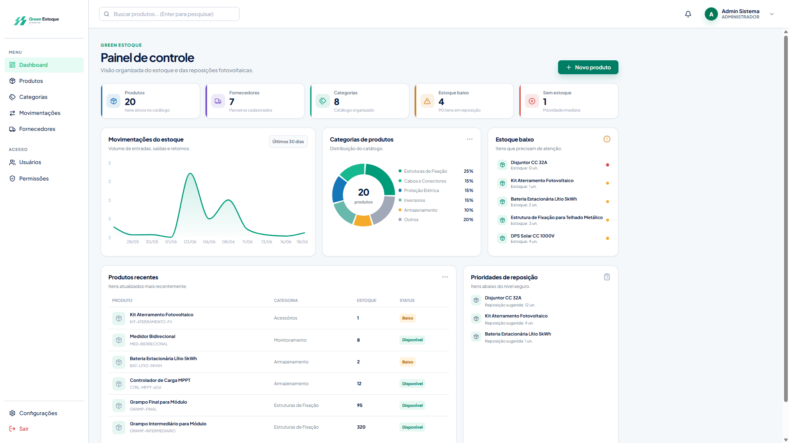
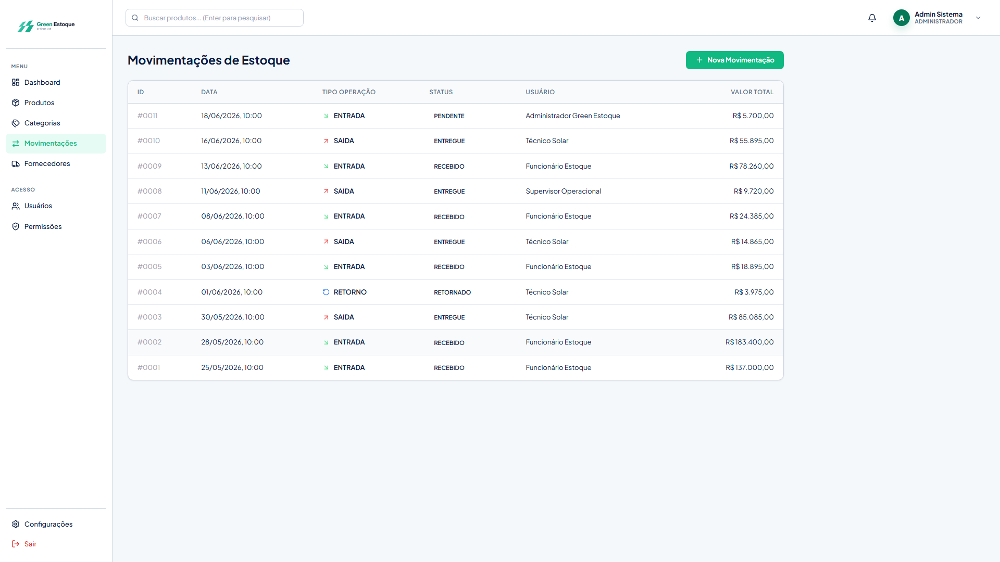
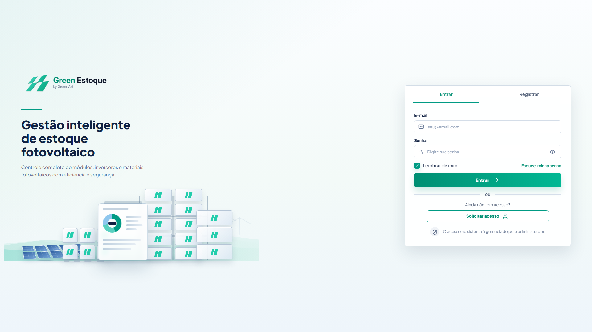
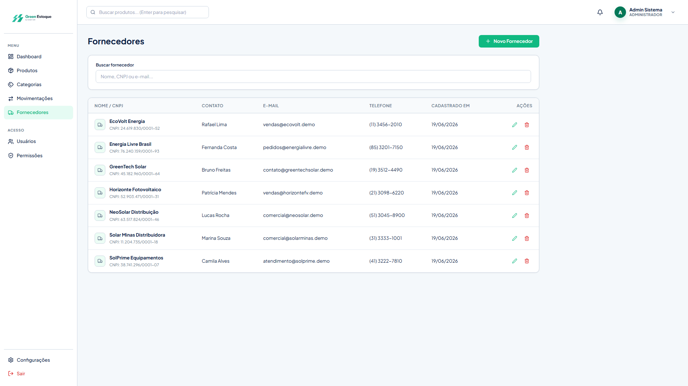

# Projeto de interface

<span style="color:red">Pré-requisitos: <a href="02-Especificacao.md"> Especificação do projeto</a></span>

O projeto de interface do **Green Estoque** foi desenvolvido para facilitar o uso do sistema pelos colaboradores da Green Volt. A proposta visual prioriza uma navegação simples, objetiva e organizada, permitindo consultar produtos, cadastrar itens, registrar movimentações e acompanhar informações do estoque com poucos cliques.

A interface foi pensada para reduzir a dependência de controles manuais, facilitar a localização de informações e tornar o uso do sistema mais rápido e intuitivo.

---

## User flow

O fluxo principal do usuário começa no login e direciona para o dashboard, onde ficam disponíveis os principais módulos do sistema.

```text
Acessar sistema
      ↓
Tela de login
      ↓
Dashboard
      ↓
Selecionar módulo
  ├── Produtos
  ├── Cadastro de produto
  ├── Movimentações
  ├── Cadastro de movimentação
  └── Sair
```

---

## Diagrama de fluxo

### Consulta de produto

```text
Login
  ↓
Dashboard
  ↓
Produtos
  ↓
Pesquisar ou filtrar produto
  ↓
Visualizar quantidade e status
```

### Movimentação de estoque

```text
Login
  ↓
Dashboard
  ↓
Movimentações
  ↓
Nova movimentação
  ↓
Selecionar produto
  ↓
Informar tipo e quantidade
  ↓
Salvar movimentação
```

---

## Wireframes

Os wireframes representam a estrutura inicial das principais telas do sistema, com foco na organização dos elementos, navegação e disposição das informações.

| Tela                     | Objetivo                               |
| ------------------------ | -------------------------------------- |
| Login                    | Permitir acesso seguro ao sistema      |
| Dashboard                | Exibir visão geral do estoque          |
| Produtos                 | Listar, pesquisar e consultar produtos |
| Cadastro de produto      | Registrar novos itens                  |
| Movimentações            | Listar entradas e saídas               |
| Cadastro de movimentação | Registrar movimentações de estoque     |


---

## Protótipo interativo

O protótipo interativo foi criado para simular a navegação pelas principais telas do Green Estoque, permitindo validar a organização visual e o fluxo de uso antes da implementação final.

Telas contempladas:

* Login;
* Dashboard;
* Produtos;
* Cadastro de produto;
* Movimentações;
* Cadastro de movimentação.

**Link do protótipo ou aplicação:**


[Protótipo no Figma](https://www.figma.com/proto/GOwry8to5qyTEeV3px09Ik/Inventory-Management-Dashboard--Community---Copy-?node-id=1502-646)

---

## Jornada do usuário

A jornada do usuário representa o caminho percorrido por um colaborador ao utilizar o sistema para consultar produtos ou registrar movimentações.

| Etapa       | Ação do usuário                    | Percepção esperada |
| ----------- | ---------------------------------- | ------------------ |
| Acesso      | Entra no sistema com login e senha | Segurança          |
| Consulta    | Pesquisa produtos no estoque       | Agilidade          |
| Análise     | Visualiza quantidade e status      | Clareza            |
| Ação        | Registra entrada ou saída          | Confiabilidade     |
| Finalização | Sistema atualiza os dados          | Menos retrabalho   |

---

## Interface do sistema

A interface do Green Estoque utiliza uma estrutura com menu lateral, área principal de conteúdo, cards, tabelas e botões de ação. O objetivo é manter as informações organizadas e facilitar o acesso às funcionalidades mais usadas.

---

## Tela principal do sistema

### Dashboard

O dashboard é a tela principal após o login. Ele apresenta uma visão geral do estoque e indicadores importantes para acompanhamento rápido.

Principais elementos:

* resumo do estoque;
* produtos cadastrados;
* produtos com estoque baixo;
* movimentações recentes;
* alertas;
* atalhos para os principais módulos.



---

## Telas dos processos BPMN

### Processo 1 — Consulta e localização de produtos

#### Tela de produtos

A tela de produtos permite listar, pesquisar e consultar os itens cadastrados no estoque.

Principais funcionalidades:

* pesquisa por nome, categoria, marca ou código;
* visualização da quantidade disponível;
* indicação do status do estoque;
* acesso ao cadastro ou edição de produtos.


#### Tela de cadastro de produto

A tela de cadastro permite inserir novos produtos no sistema, padronizando as informações do estoque.

Campos principais:

* nome;
* categoria;
* marca;
* código ou SKU;
* quantidade;
* estoque mínimo;
* fornecedor.


---

### Processo 2 — Registro de entrada e saída

#### Tela de movimentações

A tela de movimentações apresenta o histórico de entradas e saídas registradas no sistema.

Principais informações:

* produto;
* tipo de movimentação;
* quantidade;
* data;
* responsável, quando disponível.



#### Tela de cadastro de movimentação

A tela de cadastro de movimentação permite registrar entradas ou saídas de produtos. Após o registro, o sistema atualiza automaticamente a quantidade em estoque.

Campos principais:

* produto;
* tipo de movimentação;
* quantidade;
* data;
* observação.


---

## Demais telas do sistema

### Tela de login

A tela de login controla o acesso ao sistema, permitindo que apenas usuários autorizados utilizem a aplicação.



### Tela de fornecedores

A tela de fornecedores permite cadastrar e consultar fornecedores vinculados aos produtos do estoque, caso essa funcionalidade esteja disponível na versão final.



---

## Considerações finais

O projeto de interface do Green Estoque foi planejado para ser simples, funcional e alinhado à rotina da Green Volt. As telas priorizam agilidade, organização e facilidade de uso, apoiando os processos de consulta de produtos e registro de movimentações.
