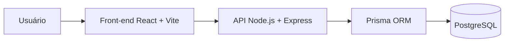
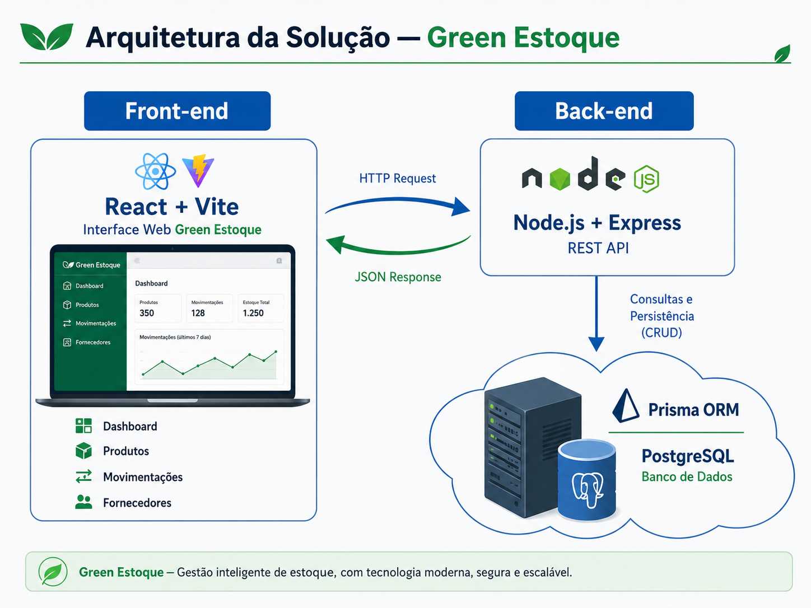
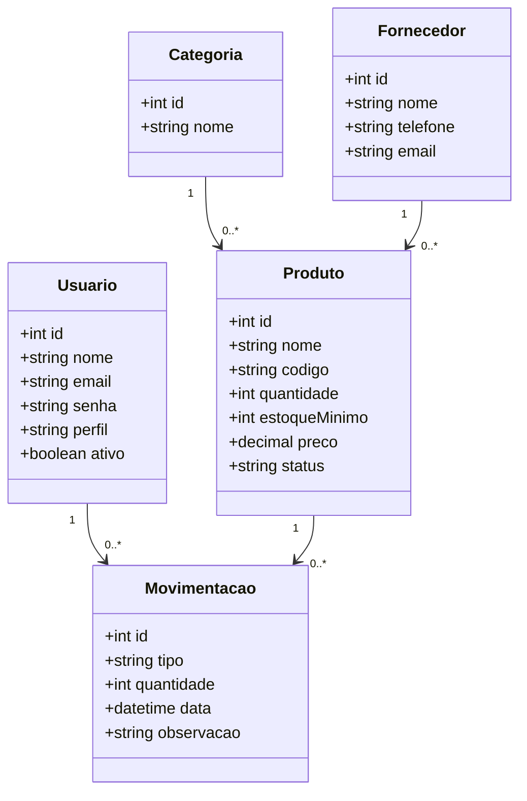
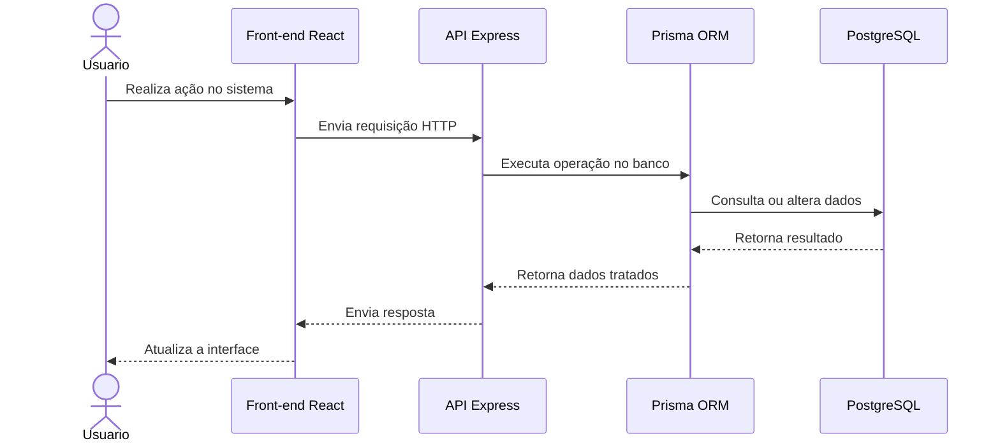

# Arquitetura da solução

<span style="color:red">Pré-requisitos: <a href="05-Projeto-interface.md"> Projeto de interface</a></span>

A arquitetura do **Green Estoque** foi definida no modelo **Client/Server**, separando a interface do usuário, a API da aplicação e o banco de dados. Essa divisão facilita a manutenção, a escalabilidade e a organização do projeto.

O sistema é composto por três camadas principais:

* **Front-end:** interface web acessada pelo usuário;
* **Back-end:** API responsável pelas regras de negócio;
* **Banco de dados:** armazenamento das informações do sistema.

---

## Visão geral da arquitetura

O usuário interage com a interface web desenvolvida em **React + Vite**. Essa interface envia requisições HTTP para a API desenvolvida em **Node.js + Express**. A API processa as regras de negócio, valida os dados e utiliza o **Prisma ORM** para se comunicar com o banco de dados **PostgreSQL**.





---

## Estrutura da solução

A estrutura do projeto foi organizada em dois módulos principais:

```text
src/
├── backend/
│   ├── prisma/
│   ├── src/
│   ├── database.sql
│   ├── prisma.config.ts
│   └── package.json
│
├── frontend/
│   ├── public/
│   ├── src/
│   ├── index.html
│   ├── vite.config.js
│   └── package.json
│
└── README.md
```

O **backend** concentra a API, as regras de negócio, autenticação, rotas e integração com o banco. O **frontend** concentra as telas, componentes, estilos e consumo das rotas da API.

---

## Diagrama de classes

O diagrama de classes representa as principais entidades do Green Estoque e seus relacionamentos.



---

## Modelo de dados

O banco de dados do Green Estoque foi planejado para armazenar informações de usuários, produtos, categorias, fornecedores e movimentações de estoque.

### Modelo conceitual

As principais entidades do sistema são:

| Entidade     | Descrição                                             |
| ------------ | ----------------------------------------------------- |
| Usuário      | Representa as pessoas autorizadas a acessar o sistema |
| Produto      | Representa os itens cadastrados no estoque            |
| Categoria    | Agrupa produtos por tipo ou finalidade                |
| Fornecedor   | Representa empresas ou pessoas que fornecem produtos  |
| Movimentação | Registra entradas e saídas de produtos                |

### Relacionamentos principais

| Relacionamento                 | Descrição                                            |
| ------------------------------ | ---------------------------------------------------- |
| Categoria possui Produtos      | Uma categoria pode ter vários produtos               |
| Fornecedor fornece Produtos    | Um fornecedor pode estar vinculado a vários produtos |
| Produto possui Movimentações   | Um produto pode ter várias entradas e saídas         |
| Usuário registra Movimentações | Um usuário pode registrar várias movimentações       |


---

### Modelo relacional

O modelo relacional organiza os dados em tabelas com chaves primárias e estrangeiras.

| Tabela        | Campos principais                                                                | Relacionamentos                                           |
| ------------- | -------------------------------------------------------------------------------- | --------------------------------------------------------- |
| usuarios      | id, nome, email, senha, perfil, ativo                                            | Relaciona-se com movimentacoes                            |
| categorias    | id, nome                                                                         | Relaciona-se com produtos                                 |
| fornecedores  | id, nome, telefone, email                                                        | Relaciona-se com produtos                                 |
| produtos      | id, nome, codigo, quantidade, estoque_minimo, preco, categoria_id, fornecedor_id | Relaciona-se com categorias, fornecedores e movimentacoes |
| movimentacoes | id, produto_id, usuario_id, tipo, quantidade, data, observacao                   | Relaciona-se com produtos e usuarios                      |


---

### Modelo físico

A seguir, apresenta-se uma versão inicial do script SQL para criação das principais tabelas do Green Estoque em **PostgreSQL**.

```sql
CREATE TABLE usuarios (
    id SERIAL PRIMARY KEY,
    nome VARCHAR(100) NOT NULL,
    email VARCHAR(120) NOT NULL UNIQUE,
    senha VARCHAR(255) NOT NULL,
    perfil VARCHAR(30) NOT NULL,
    ativo BOOLEAN DEFAULT TRUE,
    criado_em TIMESTAMP DEFAULT CURRENT_TIMESTAMP
);

CREATE TABLE categorias (
    id SERIAL PRIMARY KEY,
    nome VARCHAR(100) NOT NULL UNIQUE
);

CREATE TABLE fornecedores (
    id SERIAL PRIMARY KEY,
    nome VARCHAR(120) NOT NULL,
    telefone VARCHAR(30),
    email VARCHAR(120)
);

CREATE TABLE produtos (
    id SERIAL PRIMARY KEY,
    nome VARCHAR(120) NOT NULL,
    codigo VARCHAR(50) UNIQUE,
    quantidade INTEGER NOT NULL DEFAULT 0,
    estoque_minimo INTEGER NOT NULL DEFAULT 0,
    preco NUMERIC(10,2),
    status VARCHAR(30),
    categoria_id INTEGER REFERENCES categorias(id),
    fornecedor_id INTEGER REFERENCES fornecedores(id),
    criado_em TIMESTAMP DEFAULT CURRENT_TIMESTAMP
);

CREATE TABLE movimentacoes (
    id SERIAL PRIMARY KEY,
    produto_id INTEGER NOT NULL REFERENCES produtos(id),
    usuario_id INTEGER REFERENCES usuarios(id),
    tipo VARCHAR(20) NOT NULL,
    quantidade INTEGER NOT NULL,
    data TIMESTAMP DEFAULT CURRENT_TIMESTAMP,
    observacao TEXT
);
```

Esse script deve ser adaptado conforme o modelo final do banco de dados e salvo no arquivo `database.sql` ou em pasta apropriada de scripts SQL.

---

## Tecnologias

| Dimensão       | Tecnologia         | Uso                                        |
| -------------- | ------------------ | ------------------------------------------ |
| Front-end      | React + Vite       | Construção da interface web                |
| Estilização    | CSS / Tailwind CSS | Layout, responsividade e identidade visual |
| Back-end       | Node.js + Express  | Construção da API REST                     |
| Banco de dados | PostgreSQL         | Persistência dos dados                     |
| ORM            | Prisma             | Comunicação entre API e banco              |
| Autenticação   | JWT                | Controle de acesso às rotas protegidas     |
| Versionamento  | Git + GitHub       | Controle de versões e colaboração          |
| Prototipação   | Figma              | Criação das telas e fluxos                 |
| Testes de API  | Insomnia / Postman | Validação das rotas                        |
| Deploy         | Vercel / Render    | Publicação da aplicação                    |

---

## Visão operacional

A visão operacional representa o funcionamento do sistema durante o uso.



---

## Hospedagem

A aplicação foi planejada para ser hospedada em ambiente web, permitindo acesso por navegador.

A hospedagem pode ser organizada da seguinte forma:

| Parte do sistema | Ambiente sugerido            |
| ---------------- | ---------------------------- |
| Front-end        | Vercel                       |
| Back-end         | Render ou Railway            |
| Banco de dados   | PostgreSQL em ambiente cloud |
| Repositório      | GitHub                       |

A separação entre front-end, back-end e banco permite maior flexibilidade para manutenção e futuras melhorias.

---

## Qualidade de software

Para orientar a qualidade da aplicação, foram consideradas características ligadas à norma ISO/IEC 25010, com foco em usabilidade, segurança, desempenho e manutenibilidade.

| Característica   | Aplicação no Green Estoque                        | Métrica                                                |
| ---------------- | ------------------------------------------------- | ------------------------------------------------------ |
| Usabilidade      | Interface simples, objetiva e fácil de navegar    | Usuário consegue realizar tarefas com poucos passos    |
| Desempenho       | Páginas e consultas devem carregar rapidamente    | Tempo médio de resposta inferior a 3 segundos          |
| Segurança        | Acesso restrito por login e permissões            | Rotas protegidas e autenticação ativa                  |
| Confiabilidade   | Dados de estoque devem permanecer consistentes    | Redução de divergências e bloqueio de estoque negativo |
| Manutenibilidade | Código separado entre front-end, back-end e banco | Organização modular do projeto                         |
| Portabilidade    | Sistema acessível por navegador                   | Uso em computadores e notebooks sem instalação local   |

---

## Considerações finais

A arquitetura do Green Estoque foi planejada para atender às necessidades da Green Volt de forma organizada e escalável. A separação entre front-end, back-end e banco de dados permite melhor manutenção do sistema, enquanto o uso de PostgreSQL e Prisma contribui para maior consistência na persistência dos dados.

Com essa estrutura, o sistema oferece uma base adequada para cadastro de produtos, controle de movimentações, consulta de estoque, autenticação de usuários e futuras melhorias.
